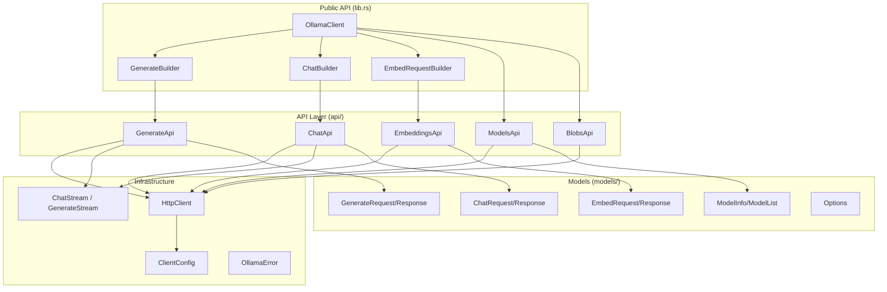

# Architecture

## Overview

The Ollama Rust SDK is a type-safe, async-first client library for the Ollama API. It provides builder-pattern request construction, streaming response handling, and comprehensive model management through a layered architecture.

## Component Map

## Key Design Decisions

**Why builder pattern for requests?** Ollama API requests have many optional parameters. Builders provide a fluent, type-safe interface that makes common cases simple and complex cases possible without constructor explosion.

**Why `Arc<HttpClient>` shared across builders?** Builders need to own a reference to the HTTP client to send requests, but the client should be shared across concurrent requests. `Arc` enables this without lifetime complications.

**Why `impl Stream` with `use<>` for streaming?** Rust 2024 edition changed lifetime capture rules for `impl Trait`. The `use<>` syntax explicitly declares that the returned stream does not capture the input reference lifetime, enabling the caller to own the stream independently.

**Why separate API and builder layers?** The API layer contains raw HTTP interaction logic. The builder layer provides ergonomic construction. This separation keeps HTTP concerns isolated and makes the builder API testable without network calls.

**Why `cargo-deny` alongside `cargo audit`?** `cargo audit` checks the RustSec advisory database. `cargo-deny` adds license policy, duplicate dependency detection, and source restrictions. Together they cover both security and compliance.
